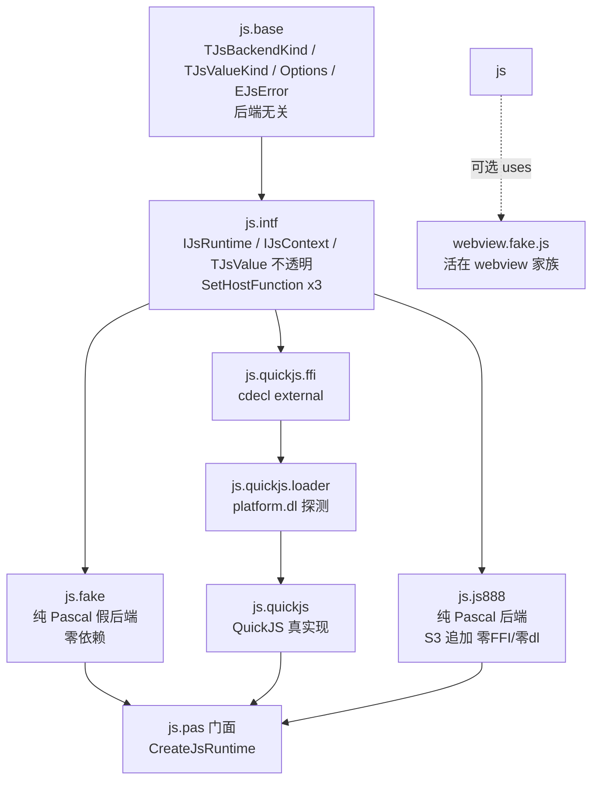

# nextpas.core.js 设计说明

**状态**：S0 冻结，随源码落地微调（六维 P0 清零）
**关联**：`CONTRACT.md`（冻结面）、`ROADMAP.md`（执行）、`ACCEPTANCE.md`（验收）、`REVIEW.md`（差距）、`AI_GUIDE.md`（AI 规范）、`SIXDIM_REVIEW.md`（六维）
**版本**：0.7（六维 P0 清零，18 份完整；增 mermaid/中断量化/体积预案）

## 0. 分层总览（`SIXDIM L-1`）



> `base` 永不触 `intf/ffi`，`intf` 永不触 `ffi/loader`，`js` 永不 `uses webview`。

---

## 1. 为何 QuickJS 首选、为何抽象

- **轻量可嵌入**：QuickJS 单 so < 500KB，启动 < 1ms，GC 堆可 `SetMemoryLimit`，适合 `webview.fake` 的无头语义与 CI。`libquickjs.so` 在 Debian/Arch 均有包，探测成本低。
- **C ABI 稳定**：`JS_NewRuntime / JS_NewContext / JS_Eval / JS_Call / JS_SetInterruptHandler` 十年稳定，FFI 成本 1 文件；V8 需 C++ 桥 + `libv8.so` 多版本 + `v8::Isolate` 线程模型，`pure Pascal` 需重实现解析器与字节码，皆作后续尾部追加。
- **抽象价值**：消费方只依赖 `js.intf`，`jsbkQuickJs → jsbkJs888/jsbkV8` 一行切换，与 `db` 的 `sqlite/pg` 同纪律；`webview/config/template` 等 L3 无需感知引擎差异。**纯后端承诺**：`js.intf` 不暴露 `JSValue`，`TJsValue` 不透明，`TJsRuntimeOptions` 后端无关，故加 `js.js888` 时 `base/intf` 零改动。

对标：`crypto` 的多后端（pure/openssl）、`compress` 的 `lz4.ffi → lz4.native` 同范式。

### 1.1 备选方案与取舍

| 方案 | 优点 | 缺点 | 结论 |
|------|------|------|------|
| `duktape` | 更小（~200KB） | ES5 为主，ES2020 缺失多，生态弱 | 放弃 |
| `goja` 纯 Go 思路的纯 Pascal QuickJS | 零 FFI，闭环 | 需重实现解析器/字节码，年级工作量 | Deferred（`jsbkJs888`，见 §9 纯后端扩展点） |
| `V8` 首选 | 性能最强 | 体积大（>10MB）、C++ ABI 脆弱、构建重 | Deferred（`jsbkV8`） |
| `QuickJS-NG` | QuickJS 分支，维护活跃 | 与原版 ABI 兼容，未来可在 loader 中同名探测 | 兼容路径（`libquickjs.so.1` 同探测） |

---

## 2. 双层值模型（为何抄 json）

**问题**：若全 `IJsValue: interface`，每次 `GetProp` 都 `AddRef/Release + JS_DupValue/FreeValue`，热循环直接 `O(n)` 接口开销，且 `TJsValue` 数组需堆分配。

**解法**：抄 `nextpas.core.json` 的 `TJsonValue(8B 借用视图) + IJsonDocument(寿命锚)`：

- `TJsValue: record` 轻量句柄（`JSValue + Context` 弱引用，16B），零接口，`AsString` 快路径直接视图。
- `IJsValueRef: interface` 仅在需桩化/跨作用域时持有，自动 `Dup/Free`。

**代价**：`TJsValue` 必须活在所属 `IJsContext` 作用域内，跨线程前先 `AsJson` 或 `IJsValueRef` 桩化。文档与测试冻结该纪律，而非编译器强制（record 无析构）。`IsValid` + `TryAs*` 提供 fail-safe。

**对比**：`webview` 的 `TJsValue` 无此问题（结果经 `AsJson` 字符串桥），但 `js` 的高频 `GetProp/SetProp/Call` 必须零分配，故双层必要。

---

## 3. FFI 纪律（为何 loader 分离）

- `*.ffi` 只含 `cdecl external` 声明（`design-conventions §6`），不含 `platform.dl`，不含逻辑，编译期可语法检查（`fpc -vh` 0 hint）。
- `*.loader` 唯一可触 `platform.dl`，幂等缓存 `TryLoadQuickJs(out Info)`，探测 `libquickjs.so.1 → .so.0 → quickjs` 三名，失败时 `JsBackendAvailable=False`，`CreateJsRuntime` 抛 `EJsBackendUnavailable`（含探测名表），不让编译锁死（同 `webview.gtk.loader` 探测 `libwebkit2gtk-4.1/4.0`）。
- 禁止 `DynLibs`（`gate policy: raw host units 仅限 owner path`），统一走 `platform.dl` 的 `DlOpen/DlSym/DlClose`。

**测试**：`test_js_quickjs_runtime` 前置 `JsBackendAvailable` 探测，CI 无库时 SKIP，`NEXTPAS_JS_QUICKJS_REQUIRED=1` 强制 fail 用于本地验证。

**静链 vs 动探**（game888 对比，见 `GAME888_BORROW.md §4`）：
- `game888` 静链 `{$linklib quickjs}` + `libquickjs.a` + `qjs_fpc_bridge.c`（单二进制、无探测、inline 直链）适合游戏客户端
- `nextpas` 动探 `platform.dl` + `libquickjs.so.1/0`（多后端可插拔、`fake` 兜底）适合框架库
- 二者对偶，`js` 选动探因需 `fake` 与尾部追加

---

## 4. 同步 Eval vs webview 异步 Eval

- `js.Eval` 同步：同线程直接 `JS_Eval`，成功 `TJsValue`，失败 `EJsError`。适合规则脚本、模板预编译、无头测试。
- `webview.Eval` 异步：跨进程 IPC + `Dispatcher.Post` exactly-once，`Close` 时在途统一 `EWebviewEvalFailed`。适合带窗场景。

二者不混用。`webview.fake` 可选注入 `IJsContext` 时，同步 `JsContext.Eval` 后仍经 `Dispatcher.Post` 异步兑现，守 `INV-7 exactly-once`（见 `WEBVIEW_LINK §2.3`）。

---

## 5. 宿主函数三形态

按 `design-conventions §8`，`SetHostFunction` 提供 `reference / of object / proc` 三重载，内部统一 `reference` 存储。`AArgs: array of TJsValue` 为切片视图，零 `interface` 数组构造，高频路径 `AArgs[0].AsString` 直取。

`AName` 校验按 JS Identifier（`^[A-Za-z_$][A-Za-z0-9_$]*(\.[A-Za-z_$][...])*`），**不复用** `webview.CheckInvokeCmd` 的 `npw./_` 保留。`a.b.c` 点路径展开为对象链（`global.a.b.c = handler`），与 `webview` 桥协议正交。

**重入**：宿主内再 `Eval` 同一 `Context` 允许（QuickJS 可重入），但禁止并发 `Eval`（线程亲和 fail-fast，`CONTRACT INV-6`）。

---

## 6. 超时与内存限

- `TimeoutMs>0` 时 `JS_SetInterruptHandler` 每 N 字节码指令轮询原子 `DeadlineMs`（`DeadlineMs: Int64` 缓存行对齐 64B，避免 false sharing；game888 无此轮询，`SIXDIM P-2`），超时抛 `EJsTimeout`，QuickJS 堆仍可用（`Tick` 后可继续）。
- `MemoryLimit>0` 时 `JS_SetMemoryLimit`/`JS_SetGCThreshold`，超限抛 `EJsMemoryLimit`，fail-closed。
- 二者均在 `TJsRuntimeOptions` 记录，`CreateJsRuntime` 与 `IJsRuntime.Set*` 双入口，`WithMemoryLimit/WithTimeout` 为 inline 便捷。
- V8 路径差异：`V8::TerminateExecution` 后需重建 `Context`，契约显式区分（`CONTRACT §7`）。

---

## 7. 依赖与分层

```
L2 js:  base(后端无关) → intf(不透明TJsValue) → {fake, quickjs.ffi←loader←quickjs, pure} → 门面
         ↳ pure 与 quickjs 平级，零 ffi/零 dl，复用同 intf
L3 webview:  ... → {bridge,fake,gtk} → factory → 门面 ─(可选 uses)→ js.intf
         ↳ webview.fake.js 归属 webview 家族（`SIXDIM M-4`），由 js 侧提 PR、webview 侧审查
```

`js` 永不 `uses webview.*`，`webview` 的适配活在 `webview` 家族（`webview.fake.js` 或 `webview.adapter.js`），`js` 不感知。**体积预案**：`js.intf` >500 行拆 `js.value/host`，`js.quickjs` >800 行拆 `js.quickjs.runtime/value/host`，`js.js888` 同 800 阈值（`SIXDIM M-1/M-2`）；**纯后端约束**：`js.js888` 禁 `platform.dl/ffi`，与 `js.fake` 同检。

**层级校验**：`core/tests/architecture/check_source_contracts.py` 扫描 `js` 闭包不得含 `webview/http/tui`；`base/intf` 不得含 `platform.dl`；`grep -R "quickjs\|v8" core/src/nextpas.core.js.base.pas` 守 `INV-1`；`grep -R "platform\.dl" core/src/nextpas.core.js.js888.pas` 0 命中。

---

## 8. 基准与测试设计

- **基准框架**：`nextpas.core.bench`（`design-conventions §12`），禁自定义计时。`bench_eval` 覆盖 `Eval('1+2')`、`HostFunction` 往返、`NewJson/ToJson` 互转，输出 `ns/op` 与 `MB/s`（若涉二进制）。
- **测试框架**：`nextpas.core.test`（`TTestSuite + TSuiteRunner`），`fake` 契约测试全量走 `fake` 后端，`quickjs_runtime` 仅在探测到库时跑。
- **Heaptrc**：所有 `focused` 套件 `heaptrc 0 leaks` 为门禁（`mem` 契约）。

---

## 9. 纯 Pascal 后端扩展点（保证后期方便）

**目标**：S3 以 `js.js888` 落纯 Pas 后端时，`js.base/js.intf` 零改动，消费方一行切换 `jsbkQuickJs → jsbkJs888`，同套 `test_js_fake` 用例对纯后端全绿。

| 项 | 约定 | 说明 |
|---|---|---|
| 模块 | `nextpas.core.js.js888.pas` 单单元（>800 再拆 `js.js888.*`），平级于 `js.quickjs`，不经 `ffi/loader` | 零 `platform.dl`，`JsBackendAvailable(jsbkJs888)=True` 恒真 |
| 枚举 | `TJsBackendKind` 尾部追加 `jsbkJs888`（S1 仅 2 值，S3 加第 3 值） | `CreateJsRuntime(jsbkJs888, SameOptions)` 同签名 |
| 值语义 | `TJsValue` 不透明句柄版图保持 16B，纯侧自有 `TJsPureValue`/`TJsPureHeap` 句柄，`Kind/As*/TryAs*/IsValid` 与 QuickJS 侧**完全同契约** | `CONTRACT §3.1` 已后端无关 |
| 中断/内存 | `TimeoutMs` 由纯侧自有 `DeadlineMs` 轮询（同 QuickJS 的 `JS_SetInterruptHandler` 语义，抛 `EJsTimeout`），`MemoryLimit` 由纯侧堆计数 fail-closed 抛 `EJsMemoryLimit` | `CONTRACT §7/§8` 同错误码 |
| 宿主/JSON | `SetHostFunction` 三形态 + `NewJson/ToJson` + `GetProp/SetProp/Call` 语义逐字同 `js.intf`，纯侧经 `json` owner | `TESTING §3` 同矩阵 |
| 测试 | 纯后端必过 `test_js_fake` 同矩阵 + `test_js_js888_runtime`（新增，恒跑无需 so），`bench_eval` 对纯后端同 `ns/op` 口径 | `ACCEPTANCE G-M4` |
| 演进 | 纯侧可先满足 ES5 + 常用 ES2020 子集（`let/const/arrow/…` 按需），`PARITY` 记“纯/QuickJS 语义差”；不等全量 ES 再落地 | 避免年级阻塞 |

> **为何现在就能保证**：`js.intf` 未暴露任何 `JSValue/JSRuntime*` 类型，`TJsValueKind/TJsErrorCategory/TJsRuntimeOptions` 已后端无关，`fake` 已证明“零 FFI 后端可过同契约”—— 纯后端复用 `fake` 的同约束，仅把 `Eval` 换成真解释器。

## 9.1 取舍与非目标

- 不做 ES Module / VFS / Worker / Inspector（Deferred，见 CONTRACT §12；game888 的 `ModuleNormalize/Loader + js_std_add_helpers` 为参考实现，见 `GAME888_BORROW.md B4`）。
- 不做 `TJsValue` 的类式 DOM（`json` 已废止 class-DOM，前车之鉴）。
- 序列化一律经 `json` owner，不手写扫描。
- 不做 `TJsValue` 的运算符重载（Pascal 风格显式 `As*`/`TryAs*`）。
- 热循环批处理（`ecs_batch_get/set`）不进 S1，`>1000` 实体/帧触发时加 `GetBatch/SetBatch`（game888 B3，见 `GAME888_BORROW.md`）。

---

## 10. 消费者审计

| 潜在消费者 | 需求 | 本设计是否满足 |
|------------|------|----------------|
| `webview.fake` | 无 `libwebkit2gtk` 时的真 JS 语义回归 | 是（可选 `JsContext` 注入，CI 仍零依赖） |
| `template` 预编译 | 无窗求值 + 超时 | 是（`TimeoutMs` + `Eval` 同步） |
| `config` 规则脚本 | 宿主函数 + JSON 互通 | 是（`SetHostFunction` + `NewJson/ToJson`） |
| `tui` 脚本扩展 | 纯 Pascal 后端（零 so） | Deferred（`jsbkQuickJsPure`） |
| `game888` ECS 脚本 | 批量 `ecs_*` + 热重载 | 借鉴：`TJSGameRuntime` 多桥组合在消费侧（`GAME888_BORROW.md B6`），`js` 不内置 ECS |

---

---

## 11. 风险与缓解

| 风险 | 缓解 |
|------|------|
| `TJsValue` 悬垂（Context 释放后使用） | `IsValid` + `As*` 安全默认 + `TryAs*` 分叉，测试冻结（`INV-7`） |
| 宿主闭包循环引用（`Context` ↔ 闭包） | 文档明示弱引用/作用域桩，`fake` 用例演示 |
| `libquickjs` 多名探测差异 | loader 幂等缓存 + `JsBackendAvailable` 探测矩阵测试 |
| 超时后堆不可用（V8 路径） | 契约写明 V8 需重建 `Context`，QuickJS 可续 |
| QuickJS 上游停更 | `QuickJS-NG` 同 ABI 兼容探测，`pure` 后端兜底 |

---

## 12. 参考

- `core/docs/design-conventions.md` §2/§3/§6/§8/§12
- `core/docs/json/CONTRACT.md`（双层借用视图）
- `core/docs/webview/CONTRACT.md` §3/§4/§7（线程与 exactly-once）
- `core/docs/db/CONTRACT.md`（尾部追加枚举、工厂探测）
- `core/docs/crypto/CONTRACT.md`（多后端分层）
- `core/docs/bench/README.md`（基准框架）
- `core/docs/js/GAME888_BORROW.md`（game888 借鉴审计）

---

## 变更记录

| 日期 | 版本 | 变更 |
|------|------|------|
| 2026-08-30 | 0.2 | 初稿：双层/FFI/超时 |
| 2026-08-30 | 0.3 | 生产级：备选方案/消费者审计/基准设计/风险扩展 |
| 2026-08-30 | 0.4 | 冻结：关联 ROADMAP/ACCEPTANCE/AI_GUIDE，12 份闭环 |
| 2026-08-30 | 0.5 | 增补：game888 借鉴（静链/动探、批处理、模块加载器、多桥组合） |
