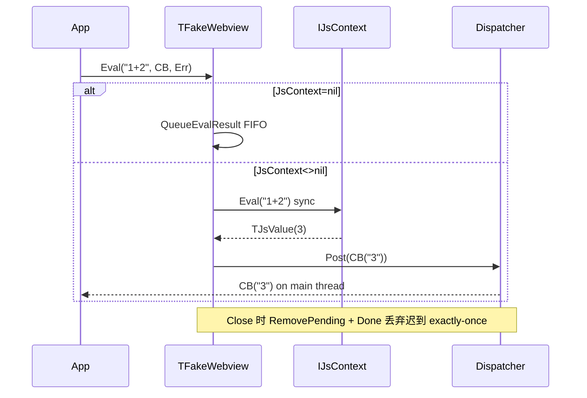

# js ↔ webview 联动设计

**状态**：S0 冻结，不产生代码
**方向**：`js` L2 底座 → `webview` L3 消费者，禁止反向依赖
**版本**：0.4（S0 冻结，12 份完整）

---

## 1. 为什么能联动、为什么不能粘连

- `webview` 已有一套 JS 运行时（WebKitGTK/WebView2/WK 各自引擎 + `NPW_BRIDGE_SCRIPT` 统一 `window.__npw.invoke/listen/emit`）。
- `js` 提供**无窗 JS**（QuickJS/V8），服务 `fake` 测试、无头预检、规则脚本、模板预编译等。
- 若把 `js` 直接塞进 `webview` 的渲染路径，会让 `webview` 强绑 `libquickjs`，违背其“后端可选探测”纪律；若把 `webview.bridge` 塞进 `js`，会让 `js` 污染为 `webview` 专用。

结论：**复用三处，不做粘连**。

---

## 2. 三处真复用

### 2.1 JSON 同源（零成本）

- `webview.bridge` 已强依赖 `nextpas.core.json`，`js.TJsValue.AsJson / JsonToJsValue` 复用同一 owner，不手写转义。
- `webview` 的 `payloadJson:string` 保持不变；联动时薄封装 `Json ↔ TJsValue`，错误码仍走 `bridge.NormalizeInvokeCode`。

### 2.2 错误码映射

| `EJsError.Category` | `webview` 桥码 |
|---------------------|----------------|
| `jecSyntax` | `npw.eval_failed` |
| `jecReference/jecType/jecRange` | `npw.handler_error` |
| `jecMemory/jecUnknown` | `npw.internal` |
| `jecTimeout` | `npw.timeout` |

- `EJsError.Species`（`SyntaxError/ReferenceError/TypeError`）透给 `webview.bridge.BuildRejectScript` 的 `message`，`Category` 影射为上表，不发明第二套词汇。

### 2.3 fake 可选真 JS 语义（收益最大）

现状 `TFakeWebview.Eval` 是 `QueueEvalResult/Error` 手动 FIFO，测 `bridge` 只测帧，不测 `1+2`。

联动方案（S2 落地，不在 S1）：

```pascal
// webview.fake 新增可选注入，不改构造签名
TFakeWebview.JsContext: IJsContext; // nil=退化为现有 FIFO
```

- 有 `JsContext` 时：`Eval` 同步 `JsContext.Eval`，但仍经 `Dispatcher.Post` 异步兑现 `Callback/AOnError`，`Close` 时 `RemovePending + Done` 丢弃迟到回执（抄 `gtk.TEvalRec.Done`），守 `webview CONTRACT INV-7 exactly-once`。
- 无 `JsContext` 时：保持现有确定性 FIFO，CI 零依赖仍绿。

收益：CI 无需 `libwebkit2gtk` 也能跑真 `JS` 语义的 `webview` 契约；`js.quickjs` 被 `webview` 契约间接回归。

**时序图**：



---

## 3. 明确不做

- 不把 `NPW_BRIDGE_SCRIPT` 塞进 `js`，不把 `CheckInvokeCmd` 复用到 `js.SetHostFunction`（`js` 标识符规则是 JS 语言规则，不是桥协议保留 `npw./_`）。
- 不为 `webview.InitScripts` 加 `js` 预校验（`bridge` 仍唯一权威，避免双源漂移）。
- 不引入 `IterateOnce` 式的主循环融合预留（`webview.CONTRACT §9 deferred-LI` 已登记）。
- 不让 `js` 直接 `Navigate` 或操作 `webview` 窗口（`js` 无窗，`webview` 有窗，职责硬隔离）。

---

## 4. 适配层归属

联动薄适配活在 `webview` 家族（例 `nextpas.core.webview.fake.js` 或 `webview.bridge.js`），`uses js.intf`，`js` 家族永不 `uses webview.*`。`core-module-registry` 中 `js` 仍是独立 L2 行，不与 `webview` 合并。

**依赖图**：

```
js (L2): base ← intf ← {fake, quickjs.ffi←loader←quickjs} ← js.pas
webview (L3): base ← intf ← {bridge,fake,gtk} ← factory ← webview.pas
                         ╲
                          ╲  (可选 uses, S2)
                           ╲→ js.intf  (仅 webview.fake.js 适配)
```

---

## 5. 工厂与注册表

- `CreateJsRuntime` 与 `CreateWebview` 工厂正交，不互相调用。
- `js` 不注册到 `webview` 的 `DefaultWebviewKind` 探测链；`webview` 的 `wvFake` 仍为兜底，`js.jsbkFake` 独立。
- `S1` 不改 `core-module-registry`；`S2` 的 `webview.fake.js` 适配不新增 registry 行，随 `webview` 的 `focused-runtime` 一并验证。

---

## 6. Deferred

| 能力 | 类别 | 触发条件 |
|------|------|----------|
| `webview` `Eval` 经 `js` 预检语法 | deferred-Perf | 大段 `InitScripts` 引发频发线上语法错 |
| `webview` 资产经 `js` import map 解析 | deferred-Mod | 首个 `ES Module` 消费方出现 |
| `webview` 桥 `invoke` 经 `js` 真执行 | deferred-Arch | `webview` 需在 `fake` 中跑真 `invoke` handler JS |

触发前不占位，不留半成品接口。

---

## 变更记录

| 日期 | 版本 | 变更 |
|------|------|------|
| 2026-08-30 | 0.2 | 初版三处复用 |
| 2026-08-30 | 0.3 | 生产级：错误映射表/时序图/依赖图/工厂说明显式化 |
| 2026-08-30 | 0.4 | 冻结：12 份闭环，版本对齐 |
