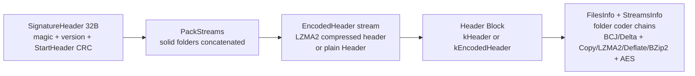

# nextpas.core.sevenz

7z archive read/write for a focused container profile: one or more solid
folders (configurable thresholds), LZMA2 (with uncompressed-chunk fallback)
or Copy payload, Deflate (`04:01:08`) and BZip2 (`04:02:02`) decode
(PPMD `03:04:01` cleanly rejected), plain or kEncodedHeader headers.
Both directions execute Delta and the full BCJ family
(x86, ARM, ARM64, PPC, IA64, SPARC, ARMT, RISCV) and the reader additionally
decodes BCJ2 four-stream folders (legacy executable archives): the reader
handles system-created archives using those chains, and the writer can
prepend an ordered prefilter chain (`SetFilters`) before LZMA2 so executables
and delta-smooth data compress better. AES-256 (code `06F10701`) works in both
directions: the reader decrypts encrypted folders and encrypted headers given
a password at construction, and the writer can encrypt the solid folders
plus the encoded header via `SetPassword`.

## Units

| Unit | Role |
|------|------|
| `nextpas.core.sevenz.base` | Container constants, method/property IDs, `TSevenZEntryInfo`, UTF-8↔UTF-16LE name conversion, FILETIME helpers, `ESevenZError` |
| `nextpas.core.sevenz.intf` | `ISevenZReader`/`ISevenZWriter`, LZMA backend contracts (`ISevenZLzmaDecoder`/`ISevenZLzmaEncoder`) |
| `nextpas.core.sevenz.header` | varint codec, StreamsInfo/FilesInfo TLV parsing, encoded-header handling |
| `nextpas.core.sevenz.coders` | coder dispatch: backend resolution, Delta/BCJ family, Deflate/BZip2, folder decode chains |
| `nextpas.core.sevenz.bcj.x86` | BCJ x86 branch/call address conversion (both directions; xz-reference algorithm) |
| `nextpas.core.sevenz.bcj.arm` | BCJ ARM branch conversion (both directions; xz-reference) |
| `nextpas.core.sevenz.bcj.arm64` | BCJ ARM64 BL/ADRP conversion (both directions; xz-reference) |
| `nextpas.core.sevenz.bcj.ppc` | BCJ PowerPC branch conversion (both directions; xz-reference) |
| `nextpas.core.sevenz.bcj.ia64` | BCJ IA-64 bundle/branch conversion (both directions; xz-reference) |
| `nextpas.core.sevenz.bcj.sparc` | BCJ SPARC branch conversion (both directions; xz-reference) |
| `nextpas.core.sevenz.bcj.armt` | BCJ ARM-Thumb BL conversion (both directions; xz-reference) |
| `nextpas.core.sevenz.bcj.riscv` | BCJ RISC-V JAL/AUIPC conversion (both directions; xz-reference) |
| `nextpas.core.sevenz.bcj2` | BCJ2 four-stream decoder (MAIN/CALL/JUMP/RC with range-coded selection; verbatim port of 7-Zip `C/Bcj2.c`, read-only) |
| `nextpas.core.compress.deflate` | Deflate coder: zlib-wrapped and raw per-message (`-15`) decode via `zlib` |
| `nextpas.core.compress.bzip2` | BZip2 coder: pure Pascal `bzip2stream` decode via zero-copy `TBytesViewStream` with combined-CRC tail tolerance, `BZip2Compress` via libbz2 `9`/`30` |
| `nextpas.core.compress.bzip2.ffi` | optional libbz2 dynamic binding (`libbz2.so.1.0`/`so`) |
| `nextpas.core.sevenz.filters` | filter registry (unifies BCJ full-family and Delta `MethodId`/`Props`/convert dispatch, table-driven, zero-alloc Delta in-place, reverse `MethodId→Filter`, `SevenZIsSupportedMethod`) |
| `nextpas.core.sevenz.aes` | AES-256 coder: props parse/build, SHA-256 key derivation (password as UTF-16LE), CBC no-padding data path |
| `nextpas.core.sevenz.lzma.rc` | range coder pair; decoder has ClipTo/RestoreLimit for LZMA2 chunk isolation |
| `nextpas.core.sevenz.lzma.decoder` | pure Pascal LZMA1/LZMA2 decoding |
| `nextpas.core.sevenz.lzma.encoder` | pure Pascal hash-chain LZMA2 encoding |
| `nextpas.core.sevenz.lzma.ffi` | optional liblzma dynamic binding (`liblzma.so.5`) |
| `nextpas.core.sevenz.reader` | signature header validation, 2-entry LRU folder decode cache, O(1) name hash index (`TSwissTableStr`, 1M entries) + dual sorted indexes (lexicographic for `EntriesByPrefix`/`FindByPrefix` and reversed for `EntriesBySuffix`/`FindBySuffix` O(log N+M) via zero-alloc `CompareReversed` `LowerBoundSuffix`) + `EntriesByGlob`/`FindByGlob` (`*`/`?` wildcard, `prefix*`/`*suffix`/`prefix*suffix` star fast-path via sorted indexes, exact via hash) + bulk `ExtractAll`/`ExtractByPrefix`/`ExtractBySuffix`/`ExtractByGlob` (grouped `ExtractIndicesGrouped` single decode per solid) + full `IgnoreCase` family (`EntriesByPrefixIgnoreCase`/`FindBy*IgnoreCase`/`EntriesByGlobIgnoreCase` O(log N) fast dispatch via `FLowerNames` + dual `SortedIdxIgnoreCase`/`RevIgnoreCase` + `prefix*`/`*suffix`/`prefix*suffix` via `LowerBoundPrefix/SuffixIgnoreCase`, `ExtractBy*IgnoreCase` grouped) (`Try*` + `Try*WithError`) , zero-alloc ASCII `FindIgnoreCase` fast path, CRC checks, `ESevenZLimitError` bomb gates (header 64MiB, pack 64MiB, `SEVENZ_MAX_*` via `limits`) |
| `nextpas.core.sevenz.writer` | archive serialization (single or multi-folder, parallel folder encode when `IsMultiThread`), zip-style entry-name safety, single-pass `Move+CRC` |
| `nextpas.core.sevenz.levels` | pure `SevenZLevelOrdToDeflateLevel`/`SevenZLevelOrdToBZip2BlockSize` mapping (`1`/`9`) reused by writer/bench/facade |
| `nextpas.core.sevenz.limits` | pure `SEVENZ_MAX_*` bomb/header constants (`64 MiB header/pack, 8 GiB total/unpack, 1M files/folders/pack streams/CRC, 1M coder props, 64 KiB name, 256 KiB extract window`) shared by reader/writer/bench/test |
| `nextpas.core.sevenz.fs` | filesystem federation: `SevenZAddTree`/`SevenZAddFileFromFs` and `SevenZExtractAllToFs` (grouped `ExtractAll` single decode per folder) + bulk `SevenZExtractByPrefix/Suffix/GlobToFs` + `IgnoreCase` bulk `SevenZExtractByPrefix/Suffix/GlobIgnoreCaseToFs` (`SevenZTryExtractByGlobToFs`/`SevenZTryExtractByGlobIgnoreCaseToFs` + `SevenZTryExtractByPrefix/SuffixIgnoreCaseToFs`, shared `FlushExtractedToFs` dedup) |
| `nextpas.core.sevenz` | facade (explicit forwarding, plus `SevenZFilterMethodId`/`SevenZFilterFromMethodId`/`SevenZIsSupportedMethod`/`SevenZMethodName` helpers, `SevenZCreateWriterBuilder`, `SevenZLevelToDeflateLevel`/`SevenZLevelToBZip2BlockSize`) |

## Container Layout



- `SignatureHeader` is little-endian: NextHeaderOffset skips solid packs + encoded header stream to reach the header block; both header CRCs are validated before any folder decode.
- Each solid folder holds one coder chain ordered as declared (filters first, compressor last, AES appended when encrypted). Multi-folder archives emit one pack stream per folder; substream windows carve the decoded folder output without extra copies.
- `TryExtract`/`TryExtractTo` wrap `Extract` with non-raising probes returning `False` on `EArgumentError`/`ESevenZError`/`ESevenZLimitError`/`EIOError`, useful for index probing without exception traffic.

## Method Support Matrix

| Method | ID | Read | Write | Notes |
|--------|----|------|-------|-------|
| Copy | `00` | ✅ | ✅ | `szclNone` / `SetMethod(Copy)` |
| LZMA2 | `21` | ✅ | ✅ | pure Pascal + `liblzma` FFI decode, pure encode |
| LZMA | `030101` | ✅ | ❌ | read-only (legacy) |
| Delta | `03` | ✅ | ✅ | via `SetFilters([szfDelta])` |
| BCJ_X86 | `03030103` | ✅ | ✅ | `szfBcjX86` |
| BCJ_ARM | `03030501` | ✅ | ✅ | `szfBcjArm` |
| BCJ_ARM64 | `03030A01` | ✅ | ✅ | `szfBcjArm64` |
| BCJ_PPC | `03030205` | ✅ | ✅ | `szfBcjPpc` |
| BCJ_IA64 | `03030401` | ✅ | ✅ | `szfBcjIa64` |
| BCJ_SPARC | `03030805` | ✅ | ✅ | `szfBcjSparc` |
| BCJ_ARMT | `03030701` | ✅ | ✅ | `szfBcjArmt` |
| BCJ_RISCV | `03030B01` | ✅ | ✅ | `szfBcjRiscv` |
| BCJ2 | `0303011B` | ✅ | ❌ | 4-stream read-only |
| Deflate | `040108` | ✅ | ✅ | `SetMethod(Deflate)` zlib, `ESevenZLimitError` on bomb |
| BZip2 | `040202` | ✅ | ✅ | `SetMethod(BZip2)` libbz2 `9`/`30`, `ESevenZLimitError` on bomb |
| PPMD | `030401` | ❌ | ❌ | `ESevenZError` clean reject |
| AES256 | `06F10701` | ✅ | ✅ | `SetPassword`, 19-cycle SHA256, random IV |

## Reader

```pascal
uses nextpas.core.sevenz;

var R: ISevenZReader;
R := TSevenZReaderImpl.Create(ArchiveBytes);   { parses and validates eagerly }
for I := 0 to R.Count - 1 do
  WriteLn(R[I].Name);                          { Count/Items default property }
for E in R do WriteLn(E.Name);                 { enumerator, zero-alloc }
if R.Contains('docs/a.bin') then
  Data := R.Extract(R.Find('docs/a.bin'));     { CRC-verified, cached per folder }
if R.TryGetEntry('docs/a.bin', Info) then
  WriteLn(Info.Size);
if R.TryEntryByName('docs/a.bin', Info) then  { alias, same as TryGetEntry }
  WriteLn(Info.Size);
WriteLn(Length(R.Entries));                    { snapshot array }
WriteLn(R.FindIgnoreCase('DOCS/A.BIN'));       { case-insensitive }

// Non-raising probe (no exception traffic for index probing)
if not R.TryExtract(Idx, Data) then
  WriteLn('missing or corrupt');
if R.TryExtractWithError(Idx, Data, Err) then
  Use(Data)
else
  WriteLn(Err); // EArgumentError / ESevenZError / EIOError message
S := nil;
if R.TryOpenStream(Idx, S) then
  Use(S);
```

For AES-encrypted folders (and `-mhe=on` encrypted headers) construct with
`TSevenZReaderImpl.CreateWithPassword(ArchiveBytes, 'pw')`. Passwords enter
the key derivation as UTF-16LE per the 7z spec; a wrong password surfaces as
`ESevenZError` from the first stage that consumes the garbage plaintext
(LZMA decode or folder CRC), and with an encrypted header even listing
entries fails. Pack streams are block-padded on the wire, so decrypted
output is truncated to the header-declared size.

Validation performed at open time: magic/version, start-header CRC, next-header
CRC, bounds of every table. Extraction verifies substream CRC when present.
Repeated extraction of the same solid folder is served from a decode cache.

## Writer

```pascal
var W: ISevenZWriter;
W := TSevenZWriterImpl.Create;
W.AddDirectory('docs');
W.AddFileWithTime('docs/x.bin', Data, 1700000000);
Archive := W.Finish;

// Fluent builder (same pipeline, chainable)
Archive := SevenZCreateWriterBuilder
  .AddFile('docs/x.bin', Data)
  .WithFilters([szfBcjX86])
  .WithLevel(szclBest)
  .WithFolderLimits(0, 1)
  .Finish;
```

Level mapping helpers (pure, in `nextpas.core.sevenz.levels`, reusable by bench/writer/facade) — `SevenZLevelToDeflateLevel` (`szclFastest→clFastest / szclDefault→clDefault / szclBest→clBest`) and `SevenZLevelToBZip2BlockSize` (`1 / 9 / 9`) ensure Deflate/BZip2 respect `szcl*` uniformly; previously both forced methods ignored the chosen level.

// Builder with filesystem (zero boilerplate via core.fs federation)
Archive := SevenZCreateWriterBuilder
  .AddTree('/host/project', 'proj')          // walks via WalkEx, mtime preserved
  .AddFileFromFs('/host/readme.md', 'proj/readme.md')
  .AddTreeWithFilter('/host/src', 'proj/src', '*.pas')
  .WithFilters([szfBcjX86])
  .Finish;

// Builder with progress (zero overhead when nil, fires per folder)
Archive := SevenZCreateWriterBuilder
  .AddFile('a.bin', DataA).AddFile('b.bin', DataB)
  .WithFolderLimits(0, 1) // 2 folders → 2 progress events
  .WithProgress(@OnProg) // procedure(Sender; ADone,ATotal)
  .Finish;

- Entries serialize into one or more solid folders compressed with LZMA2. By default a single solid folder is used; `SetFolderLimits(AMaxBytes, AMaxFiles)` splits the solid stream when either threshold is exceeded (0 means unlimited, singletons larger than the byte threshold still occupy their own folder). The split is deterministic and reproducible.
- An optional prefilter chain runs over the whole solid stream before the
  compressor: `W.SetFilters([szfBcjX86])` for x86 executables, `szfBcjArm` for ARM, `szfBcjArm64` for AArch64, `szfBcjPpc` for PowerPC, `szfBcjIa64` for IA-64, `szfBcjSparc` for SPARC, `szfBcjArmt` for Thumb, `szfBcjRiscv` for RISC-V (branch/pc-relative operands converted to absolute addresses so repeated targets collapse into literals), `szfDelta` for smoothly varying data. Filters apply in
  declaration order and are lossless length-preserving transforms; the reader
  reverses them from the folder topology alone. An empty array restores plain
  LZMA2 output; chains deeper than `C_MAX_FILTERS` (16) raise
  `EArgumentError`. Filtered output stays deterministic.
- `SetLevel` picks the coder for the solid stream and the encoded header:
  `szclNone` emits `Copy` (method `00`, zero-cost passthrough, fastest, archive
  stays close to input size and `7z l` shows `Method = Copy`), `szclFastest`/`szclDefault`/`szclBest`
  trade encoder nice-length. Default is `szclDefault`. `SetMethod(SEVENZ_METHOD_*)` overrides the solid coder explicitly (Copy/LZMA2/Deflate/BZip2 today; PPMD writer reserved, `EArgumentError` otherwise; BZip2 requires `libbz2.so.1`); `SetLevel` clears the override.
- `SetPassword` enables AES-256 encryption: an AES256 coder is appended
  to the end of each solid folder's coder chain (so decryption becomes
  the first decode stage) and the encoded-header folder gets the same
  treatment, matching reference `-mhe=on` behavior. Parameters follow
  the reference defaults: 19-cycle SHA-256 key derivation with the
  password as UTF-16LE, no salt, a CSPRNG-generated 16-byte IV per
  folder; pack streams are zero-padded to the AES block boundary and
  the header-declared sizes stay unpadded (mirroring the reader-side
  truncation). An empty string clears the password and restores plain
  output. Because of the random IVs, encrypted archives are not
  byte-deterministic.
- `SetFolderLimits` controls the multi-folder split. Single-folder remains the default for compactness; set a byte and/or file-count ceiling to obtain non-solid-compatible archives (e.g. `(0,1)` yields one folder per file, matching `7z a -ms=off`). The reader already handles arbitrary folder topologies, so mixed archives round-trip cleanly and interoperate with p7zip in both directions. When `≥2` folders are produced and `System.IsMultiThread` is true, the writer compresses folders in parallel (one `TThread` per folder, fresh per-thread LZMA encoder, AES serialised) for `--ms=off` / bounded-solid workloads.
- `BZip2` writer via `SetMethod(SEVENZ_METHOD_BZIP2)` compresses each solid folder with `libbz2` blockSize `9` / workFactor `30` (`BZip2FfiIsAvailable` guard); read path already zero-copy via `bzip2stream`. `SetMethod` now accepts Copy/LZMA2/Deflate/BZip2, PPMD remains reserved.
- Header encoding is on by default: the next-header block is recompressed
  as its own LZMA2 stream referenced via `kEncodedHeader`, matching
  reference writers (~14x smaller archives at thousands of tiny entries;
  pack stream and decoded block each carry their own CRC). Switch back to
  plain `kHeader` output with `SetEncodeHeader(False)`. Archives with no
  non-empty entries emit no orphan pack stream.
- Entry names are rejected on empty string, leading `/`, backslash, NUL (`#0`), or any
  `..` segment (`EArgumentError`).
- Unspecified timestamps default deterministically to Unix epoch 0 so the same
  input sequence produces byte-identical archives.
- `Finish` is one-shot; a second call raises `ESevenZError`.
- Streaming / incremental API: `AddFileFromReader` / `AddFileFromReaderWithTime`
  append a file from any `IReader` (filesystem, memory, pipe) with declared
  `ASize`; the declared size participates in `SetFolderLimits` and header
  bookkeeping, the stream is not drained until `Finish` / `FinishTo` where it
  is read exactly `ASize` bytes (short read → `EIOError`, `nil` → `EArgumentError`).
  `FinishTo(IWriter)` writes the four archive parts (sig / pack / hdr / block)
  piecewise to a sink without an extra full-copy. Readers can be opened from a
  byte stream via `TSevenZReaderImpl.CreateFromReader` /
  `CreateFromReaderWithPassword` (eagerly `IoReadAll` into the parse buffer) or
  the facade helpers `SevenZCreateWriter` / `SevenZCreateReader*` /
  `SevenZCreateReaderFrom*`. Streaming entries mix freely with
  `AddFile(AddFileWithTime)` byte entries, and participate in the same
  multi-folder, filter-chain and encryption pipelines.
- Filesystem federation (`nextpas.core.sevenz.fs`): `SevenZAddFileFromFs` /
  `SevenZAddTree[WithFilter]` walk a host directory via `core.fs` (`WalkEx`,
  `Stat`, `PathRelative`) and append entries with `IReader` streaming and
  `ModTime` preserved (`AddFileFromReader` under the hood); `SevenZExtractToFs`
  / `SevenZExtractAllToFs` materialize entries with `MkdirAll`/`Chtimes`, so
  `AddTree → Finish → ExtractAllToFs` round-trips a real directory tree
  byte-identically through `TempDir` (including empty dirs and `Filter+Copy` combos).
- `for..in` enumeration: `for E in Reader do` iterates `TSevenZEntryInfo` via `TSevenZEntryEnumerator` (`GetEnumerator` on `ISevenZReader`, `MoveNext`/`Current` inline, no allocation) — ergonomic over indexed `EntryCount`/`Entry` loops; `Reader.Count` / `Reader[I]` (`Items`) are default-property aliases for `EntryCount`/`Entry`.
- Progress callbacks (`Builder.WithProgress` / `Writer.SetProgress`): `TSevenZProgressEvent(Sender; ADone, ATotal)` fires once per folder after LZMA/Deflate/BZip2/Copy completes (parallel batches fire sequentially after `WaitFor`, `Assigned` guard gives zero overhead when absent). Use for `--ms=off` multi-file workloads.
- Single-pass writer `Move+CRC`: `RawSolid` fill merges `Move` and `Crc32Update` in 64KiB chunks (`MoveWithCrc` / `ReadFullyWithCrc`), halving memory passes over the solid buffer.
- Single-pass reader `ExtractTo`: incremental `Crc32Update` while streaming 256KiB windows to `IWriter`, halving reader passes (CRC mismatch raises after streaming; sink may hold bad bytes, caller discards on exception).

## API Overview

| Surface | Entry |
|---------|-------|
| Reader create | `TSevenZReaderImpl.Create(Bytes)` / `CreateWithPassword` / `CreateFromReader`(+`WithPassword`) |
| Reader inspect | `EntryCount` / `Count` / `IsEmpty` / `Entry(I)` / `Items[I]` (`Reader[I]`) / `Entries` / `Find(Name)` / `FindIgnoreCase(Name)` / `Contains(Name)` / `ContainsIgnoreCase(Name)` / `TryGetEntry(Name,out Info)` / `TryEntryByName` / `TryGetEntryIgnoreCase(Name,out Info)` / `EntryByName(Name)` / `EntryByNameIgnoreCase(Name)` / `ClearCache` / `EntriesByPrefix(Prefix)` / `EntriesBySuffix(Suffix)` / `FindByPrefix(Prefix)` / `FindBySuffix(Suffix)` / `EntriesByGlob(Pattern)`/`FindByGlob(Pattern)` (`*`/`?`, prefix/suffix/`prefix*suffix` dispatch) / `for E in Reader do` |
| Reader extract | `Extract(I)` / `ExtractTo(W,I)` / `OpenStream(I)` / `TryExtract*` / `TryOpenStream*` / `ExtractAll` + `ExtractByPrefix`/`ExtractBySuffix`/`ExtractByGlob` + full `IgnoreCase` `ExtractBy*IgnoreCase`/`EntriesBy*IgnoreCase`/`FindBy*IgnoreCase` + `TryExtractAll`/`TryExtractBy*`/`TryExtractBy*IgnoreCase` (`TSevenZExtracted`/`TSevenZExtractedArray`, folder-grouped `ExtractIndicesGrouped` single decode per solid) |
| Writer direct | `TSevenZWriterImpl.Create` → `AddFile*` / `AddFileFromReader*` / `AddDirectory*` → `SetFilters/SetLevel/SetMethod/SetPassword/SetFolderLimits/SetEncodeHeader/SetProgress` → `Finish`/`FinishTo` |
| Writer builder | `SevenZCreateWriterBuilder` → chain `AddFile*`/ `WithFilters/WithLevel/WithMethod/WithPassword/WithFolderLimits/WithEncodeHeader/WithProgress` + `AddTree/AddTreeWithFilter/AddFileFromFs` → `Build`/`Finish`/`FinishTo` |
| Filters | `szfBcjX86/Arm/Arm64/Ppc/Ia64/Sparc/Armt/Riscv` + `szfDelta`, `C_MAX_FILTERS=16` |
| Levels | `szclNone/Fastest/Default/Best` → `SevenZLevelToDeflateLevel` / `SevenZLevelToBZip2BlockSize` (`levels` unit, pure `Ord` helpers) |
| FS federation | `SevenZAddTree` / `SevenZAddFileFromFs` / `SevenZExtractToFs` / `SevenZExtractAllToFs` (grouped) / `SevenZExtractByPrefix/Suffix/GlobToFs` + `SevenZExtractBy*IgnoreCaseToFs` / `SevenZTryExtractByGlob*ToFs` + `SevenZTryExtractByPrefix/SuffixIgnoreCaseToFs` |
| Utilities | `SevenZUtf8ToUtf16Le` / `SevenZUnixToFILETIME` / `SevenZFilterMethodId` / `SevenZIsSupportedMethod` |

## Error Decision Tree

```
TryExtractWithError / TryOpenStreamWithError (probe → False + AError string, never raises)
   ├─ invalid index → EArgumentError
   ├─ truncated / CRC mismatch / PPMD → ESevenZError
   ├─ header/pack bomb (NextHeaderSize>64MiB, pack>64MiB, total>8GiB, unpack>8GiB) → ESevenZLimitError
   └─ sink short write → EIOError

Extract / ExtractTo / OpenStream (raise)
   same mapping, caller catches at boundary (HTTP/TUI handler) — no TryXxx needed for straight-line code

Writer validation (eager, before Finish)
   filter depth >16 → EArgumentError
   unknown SetMethod → EArgumentError
   AddFile("") / absolute / "\" / ".." → EArgumentError
   second Finish → ESevenZError
```

## LZMA backends

`nextpas.core.sevenz.coders` resolves one of three requested backends:

| Requested | Behavior |
|-----------|----------|
| `szlbAuto` (default) | liblzma FFI when loadable, pure Pascal otherwise |
| `szlbPurePascal` | always pure Pascal |
| `szlbFfi` | liblzma; falls back to pure Pascal when unavailable |

The FFI path uses `lzma_raw_buffer_decode`. Two format facts are load-bearing:

- **7z LZMA1 streams usually have no EOS marker** — the container stores exact
  sizes instead. Decode therefore goes through `LZMA_FILTER_LZMA1EXT`
  (liblzma ≥ 5.x that ships it) with `ext_size` set to the container's unpack
  size and `ALLOW_EOPM` set; older libraries fall back to plain
  `LZMA_FILTER_LZMA1`, which only supports streams that carry the end marker.
- **Container coder props differ per method**: LZMA2 props encode dictionary
  size (≤ 40), while in-stream chunk "newProps" bytes use the lc/lp/pb combo.
  The writer emits dict code 28 (=64 MiB, matching the encoder window).

The encoder side is always pure Pascal today.

## Verification

- Focused gate: `make -C core/tests/nextpas.core.sevenz/test_sevenz clean test`
  (166 tests: UTF conversion edge cases, FILETIME, LZMA2 round trips incl. stored-fallback
  and chunk-cap boundaries, backend switching, writer→reader container round
  trips, reader/writer error paths, Delta/Deflate/BZip2 vectors (zlib/raw dual path
  and p7zip BZip2 golden, zero-copy view stream, Deflate/BZip2 bomb via `ESevenZLimitError`), BCJ full-family round trips (x86/ARM/ARM64/PPC/IA64/SPARC/ARMT/RISCV),
  `for..in` enumerator + `Count`/`Items`/`Entries`/`IsEmpty`/`Contains`/`ContainsIgnoreCase`/`TryGetEntry`/`TryEntryByName`/`TryGetEntryIgnoreCase`/`EntryByName`/`EntryByNameIgnoreCase`/`FindIgnoreCase` (single-pass zero-alloc ASCII fast path, non-ASCII fallback via `LowerCase`) + O(1) name hash index (`TSwissTableStr`, first-occurrence stable, duplicate-name aware, 200-entry correctness stress) + `EntriesByPrefix`/`EntriesBySuffix` dual sorted O(log N+M) via `LowerBoundPrefix`/`LowerBoundSuffix` (zero-alloc reversed compare, empty/all & miss edge, duplicate aware, lexicographic) + `FindByPrefix`/`FindBySuffix` O(log N) no-alloc + `EntriesByGlob`/`FindByGlob` (`*`/`?` prefix/suffix/`prefix*suffix` star fast-path via sorted indexes, exact via hash) + bulk `ExtractAll`/`ExtractByPrefix`/`Suffix`/`Glob` + full `IgnoreCase` family (`EntriesByPrefixIgnoreCase`/`FindBy*IgnoreCase`/`EntriesByGlobIgnoreCase`/`ExtractBy*IgnoreCase` + `TryExtractAll`/`Try*IgnoreCase`, `FLowerNames` + dual `SortedIdxIgnoreCase`/`RevIgnoreCase` + `ExtractIndicesGrouped` single decode per solid) + `ToFs` federation (`ExtractAll` grouped + `By*`/`By*IgnoreCase` via `FlushExtractedToFs`) + 2-entry LRU folder cache + `ClearCache` explicit control + `WithProgress` per-folder callback (zero overhead when nil, batched parallel aware) + header/pack/file-count/name NUL/binding bomb (`ESevenZLimitError`/`EArgumentError` at 64MiB header/pack, 8GiB total/unpack, 1M files/folders/pack streams/CRC, 1M coder props, 64KiB name, duplicate bind) + single-pass `Move+CRC` writer & `ExtractTo` reader (256KiB window, windowed CRC) + warnings 0,
  ExtractTo windowed writes, entry-stream semantics, synthesized kEncodedHeader archive round trip,
  writer filter chains: BCJ/Delta/two-stage and mixed-family round trips, zero-alloc Delta in-place, unified filter dispatch, Deflate/BZip2 writers via `SetMethod` (BZip2 via libbz2 mapped levels `1`/`9` + `30`, pure `nextpas.core.sevenz.levels` helpers), parallel folder encode (≥2 folders, `IsMultiThread` guarded, per-thread fresh LZMA encoder, AES serial), builder fluent API (`SevenZCreateWriterBuilder` chained, `AddTree`/`AddFileFromFs` federation) and `TryExtract` family (`TryExtractWithError`/`TryOpenStream` probes), byte-identical
  determinism, reset-to-default equality, depth validation (16), empty archive,
  a compression-gain assertion on a clustered-call x86 corpus, BCJ2 and BZip2
  golden archives harvested from p7zip (CRC-verified), truncated/PPMD-not-supported
  negative probes (BZip2 truncated, PPMD `030401`, Deflate truncated via folder),
  and AES coverage: p7zip-created golden archives in both header forms
  (CRC-verified extraction under the default and forced pure-Pascal
  backends), independent-implementation KAT vectors for key derivation
  (cycles-power 5 with salt, `$3F` splice path, and power 19 derived from
  the real wire props), props parse defaults, and wrong/empty-password
  negative paths. Writer-side encryption is covered by round trips in
  both header forms, wrong/late/cleared-password paths, a dirs-only
  archive whose encrypted header still hides names, props
  build→parse-back identity (including the 16-byte-IV nibble-carry
  encoding), an encrypt/decrypt data round trip, and an IV-uniqueness
  smoke check. Multi-folder coverage splits the solid stream by byte and file-count thresholds, including filter and password combinations, plain-header mode, dirs/empty handling, and validation/after-finish negative paths. Streaming coverage adds `AddFileFromReader` round trips (single, mixed and large ~300 KiB, multi-folder, filter+password, empty and `FinishTo` paths), nil/short-read/`CreateFromReader(nil)` negative probes, `CreateFromReader` and `CreateFromReaderWithPassword` byte-identical reads, and facade `SevenZCreate*` helper smoke checks. Copy coverage verifies `szclNone` emits `Copy` (`7z l` shows `Method = Copy`, `7z t` OK) and round-trips with filters+password. Filesystem coverage exercises `SevenZAddTree` → `Finish` → `SevenZExtractAllToFs` and `SevenZExtractToFs` single-file paths through `TempDir` (empty dirs, mtime preservation, `Copy`+`BcjX86` filtered trees).
- Interop evidence (host-dependent, `scripts/sevenz-interop.sh` automates; p7zip 17.05): system `7z t`/`7z x` accept our archives byte-compare clean
  including non-ASCII names; our reader extracts system-created archives
  byte-identically under both backends and both header forms (`-mhc=off`
  plain and `-mhc=on` encoded); raw LZMA2 cross-validation against
  `xz --format=raw` passes in both directions. Filter-chain interop is
  verified both ways: p7zip extracts our BCJ/Delta/two-stage archives in
  both header forms, and our reader decodes p7zip's BCJ+LZMA2 and
  Delta→BCJ→LZMA2 three-coder archives under both backends. BCJ2 reads
  are cross-checked against p7zip-created `-m0=BCJ2` folders both raw and
  with LZMA-compressed substreams, under both backends. AES reads are
  cross-checked against p7zip `-p…` archives containing per-file encrypted
  folders (AES256+LZMA2 and AES256+LZMA2+BCJ chains, plain and encrypted
  headers) under both backends; wrong-password probes fail cleanly with
  `ESevenZError`. Encrypted writes are cross-checked the other way:
  p7zip accepts our password-protected archives in both header forms and
  with an added BCJ prefilter (`[BCJ, LZMA2, AES256]` three-coder chain),
  extracting them byte-identically to the source tree.
- Throughput baseline: `make -C core/benchmarks/nextpas.core.sevenz/bench_sevenz run`
  measures pure-Pascal LZMA2 encode/decode against a block-mixed corpus
  (`encode pure ~8.6 MB/s / decode pure ~17.6 MB/s / ffi ~50.8 MB/s` on 1 MiB mixed),
  BCJ x86 `~325 MB/s` / Delta `~86 MB/s` (zero-alloc in-place), and warm-cache container extraction `~333 MB/s`
  (`container create multi(st)` ~15.2 MB/s raw, `extract multi` ~132 MB/s; with `cthreads` linked `multi(mt)` shows batched parallel folder speedup capped at 8 threads; `scripts/sevenz-interop.sh` covers BZip2/Deflate/BCJ+Password/Multi + `BZip2+IgnoreCase` 200-entry hybrid)
  plus `glob IgnoreCase` index bench on 2k entries (`prefix*` ~137k ops/s, `*suffix` ~5.2k, `p*s` ~4k, `exact` ~2.4M via hash) and 10k entries (`prefix*` ~129k, `*suffix` ~625, `p*s` ~649, `exact` ~1.9M, redlines `1000/500/300/100k`固化, all O(log N) fast paths)
  (decode also cross-checked with liblzma when loadable).
