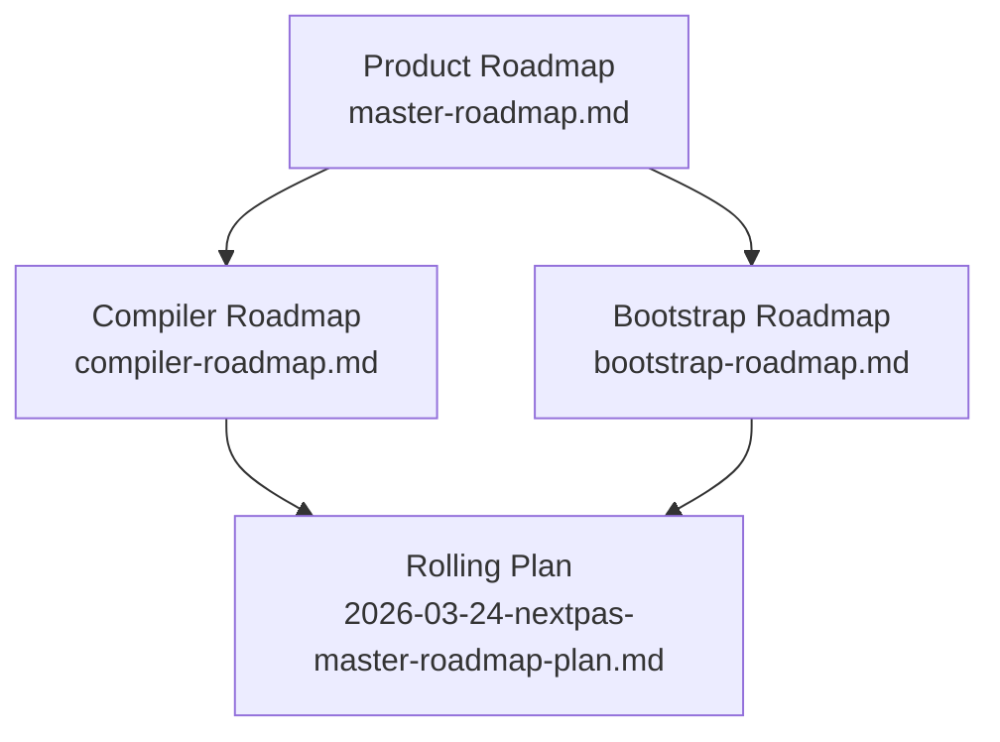
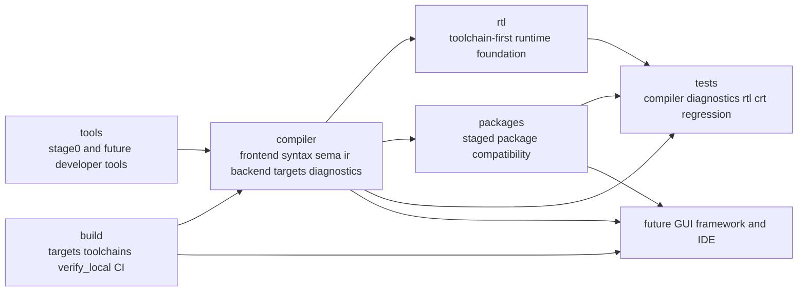

# nextPas 架构总览

nextPas 是一个与 FreePascal 兼容的现代化重构项目，长期目标是一整套下一代 Pascal
开发环境。第一阶段不会发明新的 Pascal 方言，而是先建立一套清晰、明确的架构，让项目能够
在逐步替换历史内部结构的同时，继续保留外部兼容性。

如果你要看 nextPas 整个系统应该按什么顺序从控制面走到 compiler、toolchain、workspace、
package、GUI framework 和 IDE，继续读 `master-roadmap.md`。如果你要看 compiler
自己应该按什么顺序接管，继续读 `compiler-roadmap.md`。如果你要看
`stage0 -> stage1 -> stage2` 的自举所有权路径，继续读 `bootstrap-roadmap.md`。
如果你要看所有设计与实现批次共同遵守的质量门槛，先读
`architecture-principles-specification.md`。

## 先按三层路线图理解 nextPas

在当前仓库里，路线图最好分三层读：

- 产品路线图：`master-roadmap.md`
- 编译器路线图：`compiler-roadmap.md`
- 自举路线图：`bootstrap-roadmap.md`

这样拆分的原因很简单：

- 产品路线图回答 nextPas 作为整套开发环境先长什么
- 编译器路线图回答 compiler execution spine 应该先收紧什么
- 自举路线图回答谁来拥有构建路径

三者必须一起工作，但不应该再被误读成同一份计划。

## 用图看三层路线图

先看这三层之间的关系：

这张图要表达的重点只有两个：

- 产品路线图决定 nextPas 整体先长什么
- 编译器路线图和自举路线图一起约束当前执行计划

## 保持熟悉的顶层系统边界

第一阶段从第一天起就明确保留这些顶层区域：

- `compiler`：语言前端、语义、IR、目标平台处理和驱动控制面
- `rtl`：运行时库表面以及底层运行时支持
- `packages`：核心 RTL/CRT 之外的分阶段包兼容
- `tests`：编译、诊断、运行时、CRT 与回归验证
- `tools`：`stage0` 入口以及未来面向开发者的工具
- `build`：可重复的编排、目标平台规格和本地验证入口

这种布局保留了 FreePascal 生态中可识别的外层边界，同时给 nextPas 留出了
重构内部实现方式的空间。

## 用图看系统边界

把 nextPas 当前推荐的系统边界压缩成一张图，可以先这样看：

这张图不是在说“今天已经全部实现”，而是在说 nextPas 现在推荐怎样理解系统边界：

- `compiler` 是内核，但不是产品全部
- `build`、`tools`、`rtl`、`packages` 和 `tests` 都是正式系统边界
- future GUI/IDE 必须建立在同一套 compiler/toolchain/workspace truth 之上

## 第一阶段仅支持 Linux x86_64

第一阶段只支持 Linux x86_64。本仓库中的每一条架构承诺，包括自举路径、
发行布局、smoke 测试和 CI 入口，都必须先在 Linux x86_64 上可执行，
之后才能讨论更广的平台扩展。

## 先以 FreePascal 完成自举

FreePascal 是 nextPas 的 `stage0` 编译器。第一版 `stage0` `nextpas` 驱动入口可以
调用 FPC、编译 smoke 样例，并先把验证路径打通，再逐步把更多编译器
职责收回到 nextPas 自己手里。

这条边界是刻意设计的：

- nextPas 负责项目结构、兼容性规则与验证规范
- FPC 负责最初的自举编译器角色，直到 nextPas 准备好接管更多栈层

## compiler 是内核，不是产品全部

nextPas 当然要有现代化 compiler kernel，但它的公开边界不该只剩 `compiler/`。

从长期架构看，nextPas 至少同时包含：

- `compiler`：语言前端、语义、IR、backend 与 target-aware lowering
- `tools`：开发者命令表面与更高层 workflow 入口
- `build`：target specs、toolchain bindings、local verification 与 CI glue
- `rtl` / `packages`：运行时和生态资产
- `tests`：可重复验证与留证控制面

第一阶段只先把最小 `stage0` 路径做实，不等于长期架构把其余开发环境层都忽略。

## 用图看编译器主流水线

编译器内部的推荐主流水线可以先压成下面这张图：

如果你想继续往下读，这张图分别对应：

- `compiler-roadmap.md`：为什么这一条链要按这个顺序接管
- `compiler-specification.md`：这些阶段分别归谁拥有
- `compiler-pipeline-specification.md`：每一层的输入、输出和失效边界

## GUI 体系不会延续 LCL

nextPas 的长期 GUI 方向也必须在这里点明：它不会把自己设计成 LCL 的现代皮肤或兼容壳。

项目长期要走的是：

- 一个全新的 Pascal GUI 体系
- 一条显式的 platform shell boundary
- 一条统一的 runtime control plane
- 一条统一的 interaction control plane
- 一条统一的 layout control plane
- 一条统一的 style/theme control plane
- 一条统一的 motion control plane
- 一个硬件加速的 UI framework
- 一条独立的 accessibility control plane
- 与 compiler、runtime、packages、toolchain 协同设计的现代 UI stack

这条方向的意义是：

- GUI 不再围绕历史 widgetset 兼容层组织
- 渲染、布局、事件与资源模型不再默认继承 LCL 的抽象
- 后续 GUI 生态应该建立在 nextPas 自己的 runtime、package 和 distribution 边界之上

第一阶段不要求立刻实现这套 GUI framework，但架构口径必须先明确“不再是 LCL”。
更细的 UI stack 分层、runtime/toolchain/distribution 边界由
`gui-framework-specification.md` 定义。
更细的宿主 window、screen/monitor、clipboard/DnD、cursor 与 native surface integration 边界由
`platform-shell-specification.md` 定义。
更细的 UI runtime、frame pump、event dispatch、invalidation scheduling 与 main-thread handoff 边界由
`ui-runtime-specification.md` 定义。
更细的 UI interaction、focus routing、shortcut / menu / accessibility action 回流边界由
`ui-interaction-specification.md` 定义。
更细的 UI layout、bounds negotiation、scroll viewport 与 panel geometry 边界由
`ui-layout-specification.md` 定义。
更细的 UI style/theme、semantic token、theme snapshot 与 visual asset family 边界由
`ui-style-theme-specification.md` 定义。
更细的 UI motion、transition scheduling、reduced-motion policy 与 sampled temporal truth 边界由
`ui-motion-specification.md` 定义。
更细的 UI accessibility 语义树、focus/state/action snapshot 与平台 bridge 边界由
`ui-accessibility-specification.md` 定义。
更细的 scene lowering、render graph 与 surface contract 由
`ui-rendering-specification.md` 定义。
更细的 shader、icon/image、font metadata、theme/effect preprocessing 与 `RenderAssetBundle` 资产线由
`render-asset-pipeline-specification.md` 定义。

## 长期也要有自己的 IDE

nextPas 的长期产品形态不该停在 compiler 和 UI framework。IDE 也必须是正式目标，而且它不该是
外部历史 IDE 的被动适配层。

长期顺序应明确写成：

- 先完成 compiler kernel
- 再完成自有 GUI framework
- 然后在这套 UI stack 之上完成自己的 IDE

更细的 workspace truth 边界由 `workspace-specification.md` 定义。
更细的 workspace descriptor、package manifest、lockfile 和 root discovery 由
`workspace-file-format-specification.md` 定义。
更细的 unified developer command surface 边界由 `developer-tooling-specification.md` 定义。
更细的 package manager workflow、manifest/lock/install truth 边界由
`package-workflow-specification.md` 定义。
更细的 host window、workbench clipboard / file drop 与 preview surface 宿主接缝边界由
`platform-shell-specification.md` 定义。
更细的 UI runtime、workbench frame pump、main-thread handoff 与 preview surface 生命周期边界由
`ui-runtime-specification.md` 定义。
更细的 GUI rendering / preview / surface contract 边界由
`ui-rendering-specification.md` 定义。
更细的 preview、workbench 和 app runtime 共用的 render asset pipeline 由
`render-asset-pipeline-specification.md` 定义。
更细的 UI interaction、command routing、focus path 与 command palette / workbench 共享交互边界由
`ui-interaction-specification.md` 定义。
更细的 UI layout、split/panel geometry 与 workbench viewport 边界由
`ui-layout-specification.md` 定义。
更细的 UI style/theme、visual token、resolved appearance 与 shared icon/theme asset family 边界由
`ui-style-theme-specification.md` 定义。
更细的 UI motion、workbench transition、preview timing 与 shared temporal control plane 边界由
`ui-motion-specification.md` 定义。
更细的 UI text/layout、glyph run、caret/selection 与 IME/input 边界由
`ui-text-layout-specification.md` 定义。
更细的 UI accessibility、text boundary 回流与平台 bridge 边界由
`ui-accessibility-specification.md` 定义。
更细的 shared analysis 与 query 边界由 `language-service-specification.md` 定义。
更细的 IDE/build-test orchestration 边界由 `ide-specification.md` 定义。

## 在保留外层边界的前提下做内部现代化

外部仓库布局保持熟悉，但编译器内部不需要复制 FPC 的历史平铺结构。nextPas 可以
在 `compiler` 内采用现代子模块边界，例如：

- `frontend`
- `syntax`
- `sema`
- `ir`
- `backend`
- `targets`
- `driver`
- `diagnostics`

这就是第一阶段的核心现代化规则：保留兼容性依赖的生态形状，但重构内部所有权
模型，让项目保持可维护。

## 把文档与验证视为架构本身，而不是收尾工作

架构文档、目标平台定义和测试不是后续补丁，而是系统边界的一部分：

- 文档冻结兼容性规范
- `harness` 代码把兼容性主张变成可执行检查
- smoke 样例在第一天就证明 `stage0` 路径存在

如果没有这些部分，nextPas 只有愿景，没有基线。

## 第一阶段 Non-goals（非目标）

第一阶段明确不包含：

- 新的 Pascal 语法表面
- 完整的包管理器
- IDE 或 LSP 集成
- 格式化工具或编辑器工具链对等
- 多平台发布
- 把 ABI 兼容性作为硬目标

这些内容必须被明确点名并延后，否则后续任务会悄悄发生范围膨胀。
这里的“延后”是指实现顺序延后，不是说 nextPas 长期不打算把自己设计成完整开发环境。
